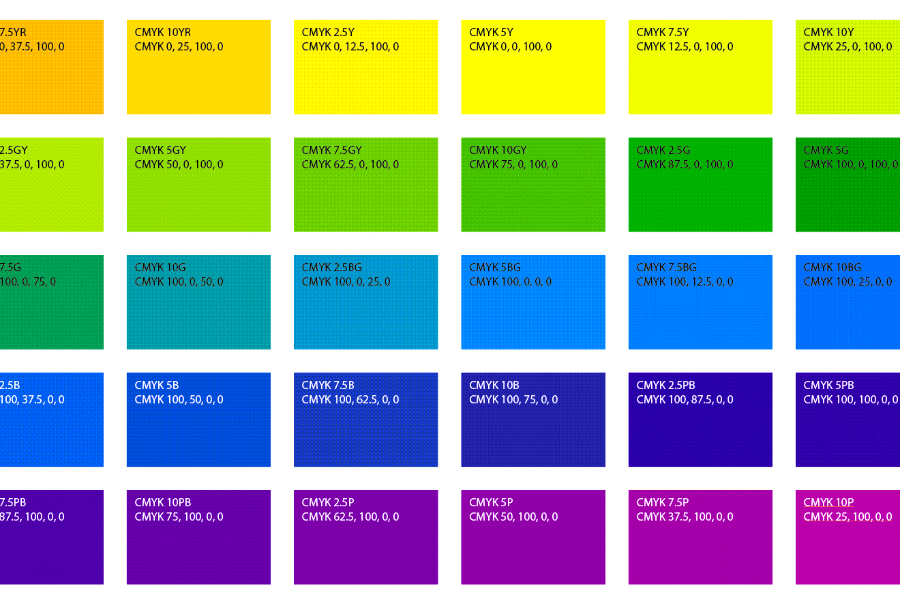

# Swatch Hero

The scripts in `swatch-hero` are what inspired **Script Hero**. 

## Swatch Legend

[swatch-legend.jsx](./swatch-legend.jsx) creates a grid of color tiles for selected swatches with options to print the swatch name and color data. 

## Export Color Data

These scripts export color data to a CSV file. Data include the source color comps and [conversions](./docs/color-conversion.md) to other color spaces.

- [swatches-export.jsx](swatches-export.jsx) exports data for all Swatches in a document.
- [item-fill-export.jsx](item-fill-export.jsx) iterates unlocked & visible `Layers`, `GroupItems`, and `PageItems` and exports the fill color.

## Apply Swatches

[swatches-random.jsx](swatches-random.jsx) randomly applies selected swatches to selected items. 

## Add Swatches

The [swatches-add](../swatches-add/README.md) directory has additional scripts for adding swatches to a document. 

